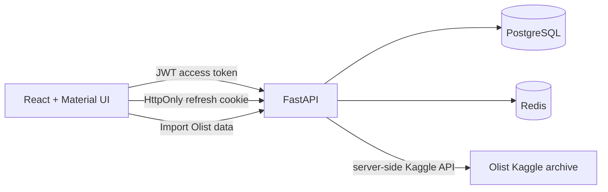

# Boutique Analytics — app overview

Boutique Analytics turns the Olist Brazilian e-commerce dataset into a protected dashboard.
The dashboard shows delivered revenue, delivered-order count, average order value, monthly
revenue, the most recent orders, and an interactive EDA section.



## Main user flow

1. Register or sign in with email and password.
2. The API issues a short-lived access token and stores the rotating refresh token in an
   HttpOnly cookie.
3. Select **Import Olist data** in the dashboard. The API downloads the configured Olist
   archive from Kaggle, validates the four CSV files, imports them in one database transaction,
   and clears dashboard cache entries.
4. The dashboard reloads its summary, monthly revenue chart, and latest orders table.

## Interactive EDA

- The date filter scopes the revenue chart, order-value distribution, and correlation analysis.
- The **Order-value distribution** is a ten-bin histogram of delivered order totals.
- The **Pearson correlation heatmap** compares four order-level numeric variables: item count,
  item value, freight, and total order value. Hovering a cell reveals the exact coefficient.
- The latest-orders table complements the charts with record-level detail.

## Local services

| Service | Address | Role |
| --- | --- | --- |
| Dashboard | `http://localhost:5173` | React interface |
| API / OpenAPI | `http://127.0.0.1:8000/docs` | Authenticated REST API |
| PostgreSQL | `localhost:5433` | Users and Olist data |
| Redis | `localhost:6380` | Dashboard cache and one-time refresh-token records |

## Kaggle setup

Create a Kaggle API token and set these backend environment values before using the import
button:

```dotenv
KAGGLE_USERNAME=your-kaggle-username
KAGGLE_KEY=your-kaggle-api-key
KAGGLE_OLIST_DATASET=olistbr/brazilian-ecommerce
```

The browser never receives these values. The importer accepts only the expected Olist customer,
product, order, and order-item CSV files, limits archive size, and rejects unsafe archive paths.
