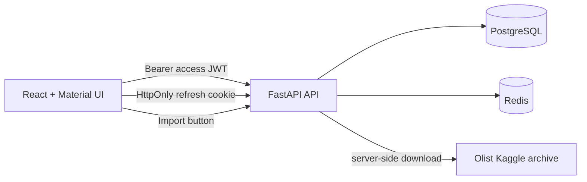

# Boutique Analytics

Boutique Analytics is a protected, interactive analytics dashboard built around the
[Olist Brazilian E-Commerce dataset](https://www.kaggle.com/datasets/olistbr/brazilian-ecommerce).
It is designed as a small production-style data application: users sign in, import a
validated dataset server-side, and explore operational metrics, charts, and order-level
records without exposing the data-provider credentials to the browser.

## What the project demonstrates

- A React + TypeScript dashboard built from reusable Material UI components.
- Local registration and login with short-lived access JWTs plus rotating HttpOnly refresh
  cookies.
- FastAPI endpoints, typed request/response schemas, and OpenAPI documentation.
- PostgreSQL persistence managed with SQLAlchemy and Alembic migrations.
- Redis cache-aside reads for dashboard aggregates and refresh-token replay protection.
- A server-side Kaggle importer that validates the Olist archive before writing data.
- Interactive exploratory data analysis (EDA): date filtering, revenue trends, an order-value
  histogram, an orders table, and a Pearson-correlation heatmap.
- A clean / hexagonal backend boundary, so HTTP, database, cache, and authentication adapters
  do not leak into the domain or application use cases.

## Architecture



Within the API, dependencies point inward:

```text
presentation (FastAPI routers and schemas)
                  ↓
application (use cases and ports) → domain (business models and value objects)
                  ↑
infrastructure (PostgreSQL, Redis, JWT, Kaggle, observability adapters)
```

`backend/src/boutique/bootstrap/container.py` is the composition root. It is the one
place where production adapters are wired to application ports.

## Repository map

| Path | Purpose |
| --- | --- |
| `frontend/` | Vite, React, TypeScript, Material UI dashboard |
| `backend/src/boutique/domain/` | Validated business models, IDs, and port contracts |
| `backend/src/boutique/application/` | Use cases for auth, import, and dashboard queries |
| `backend/src/boutique/infrastructure/` | SQLAlchemy, Redis, JWT, Kaggle, and other adapters |
| `backend/src/boutique/presentation/` | FastAPI routers and HTTP schemas |
| `backend/alembic/` | Database migrations |
| `docker-compose.yml` | Local PostgreSQL and Redis services |
| `APP_OVERVIEW.md` | Concise product and EDA overview |
| `docs/cloud-deployment.md` | AWS Lambda, RDS, ElastiCache, and Amplify deployment walkthrough |

## Product flow

1. A user registers or signs in with email and password.
2. The API sends an access token to the application and stores the refresh token only in an
   HttpOnly cookie. Refresh-token IDs are single-use records in Redis.
3. From the dashboard, the user selects **Import Olist data**. The browser calls the API;
   only the API contacts Kaggle using server-side environment variables.
4. The importer checks archive paths, file size, and the four required CSV files; it then
   imports the data in one database transaction and invalidates dashboard caches.
5. The dashboard displays cached summary metrics and fresh analytical queries.

## Analytics and EDA

The dashboard is deliberately more than a KPI screen:

| View | What it answers |
| --- | --- |
| Summary cards | How many delivered orders, how much revenue, and what average order value? |
| Monthly revenue chart | How does delivered revenue move over time? |
| Latest orders table | Which individual orders make up the operational data? |
| Order-value distribution | Are delivered order totals concentrated, spread out, or long-tailed? |
| Pearson heatmap | How strongly are item count, item value, freight, and order total related? |

The **From** / **To** controls scope the monthly revenue chart, the ten-bin order-value
histogram, and the correlation calculation. Hovering a heatmap cell shows its exact Pearson
coefficient. The correlation is calculated from delivered, order-level records rather than
from already-aggregated monthly figures.

## Run locally

### Prerequisites

- Docker Desktop or Docker Engine with Compose
- [uv](https://docs.astral.sh/uv/) for the Python backend
- Node.js 20+ and npm for the frontend

### 1. Start PostgreSQL and Redis

From the repository root:

```bash
docker compose up -d
```

PostgreSQL is exposed at `localhost:5433`; Redis is at `localhost:6380` to avoid common
local-port collisions.

### 2. Start the backend

```bash
cd backend
cp .env.example .env
uv sync --all-groups
uv run alembic upgrade head
uv run fastapi dev --entrypoint boutique.main:app --reload-dir src
```

The API is available at <http://127.0.0.1:8000>; interactive API docs are at
<http://127.0.0.1:8000/docs>.

### 3. Start the frontend

In a second terminal:

```bash
cd frontend
cp .env.example .env
npm install
npm run dev
```

Open <http://localhost:5173>.

### 4. Enable the in-app Kaggle import (optional)

Add a Kaggle API token to `backend/.env`:

```dotenv
KAGGLE_USERNAME=your-kaggle-username
KAGGLE_KEY=your-kaggle-api-key
KAGGLE_OLIST_DATASET=olistbr/brazilian-ecommerce
```

Restart the API, register an account, and use **Import Olist data** in the dashboard. These
settings stay on the server and are deliberately ignored by Git.

## API surface

The OpenAPI page is authoritative for request and response shapes. The main routes are:

| Area | Routes |
| --- | --- |
| Health | `GET /api/v1/health/live`, `GET /api/v1/health/ready` |
| Authentication | `POST /api/v1/auth/register`, `login`, `refresh`, `logout`; `GET /api/v1/auth/me` |
| Dashboard | `GET /api/v1/dashboard/summary`, `revenue`, `orders`, `distribution`, `correlations` |
| Data import | `POST /api/v1/dataset/import/kaggle` |

Dashboard and import routes require an access token. The date-aware analytical endpoints use
optional `from_date` and `to_date` query parameters; invalid ranges return a validation error.

## Configuration and security

Copy `backend/.env.example` to `backend/.env` locally. Do not commit `.env` files. The most
important production values are:

| Variable | Production value / purpose |
| --- | --- |
| `ENVIRONMENT` | `production` |
| `DATABASE_URL` | RDS PostgreSQL connection URL, normally with `sslmode=require` |
| `REDIS_URL` | ElastiCache TLS connection URL, normally beginning with `rediss://` |
| `JWT_SECRET` | A unique random value of at least 32 characters |
| `COOKIE_SECURE` | `true` for HTTPS |
| `CORS_ORIGINS` | The exact public frontend origin, with no trailing slash |
| `KAGGLE_USERNAME`, `KAGGLE_KEY` | Server-only values, only if the import button is enabled |

Outside local/test environments the application refuses the default JWT secret and refuses to
start with insecure refresh cookies. A standard PostgreSQL URL from RDS is normalised to
SQLAlchemy's async driver while preserving TLS; the same normalisation is used by Alembic
migrations.

## Verification

Backend checks:

```bash
cd backend
uv run ruff check src tests
uv run ruff format --check src tests
uv run pytest
RUN_INTEGRATION_TESTS=1 uv run pytest -m integration
```

The integration suite uses the local PostgreSQL and Redis containers, creates only test users
with an `integration-` prefix, and removes them during teardown. The frontend production build:

```bash
cd frontend
npm run build
```

## Deploy to the cloud

The AWS deployment profile is **Amplify Hosting → Lambda Function URL → RDS PostgreSQL +
ElastiCache Serverless**. The API runs as the included Lambda container image with
`SERVERLESS=true`; RDS and Redis remain private in the VPC.

Follow the complete, copy-ready setup in [docs/cloud-deployment.md](docs/cloud-deployment.md).
It includes environment variables, migrations, CORS, health checks, verification, and common
operational cautions. The backend can also run as a Lambda container; see
[backend/README.md](backend/README.md) for that shape.

## Further reading

- [Application overview and EDA notes](APP_OVERVIEW.md)
- [Backend architecture, testing, and seed commands](backend/README.md)
- [Cloud deployment guide](docs/cloud-deployment.md)
