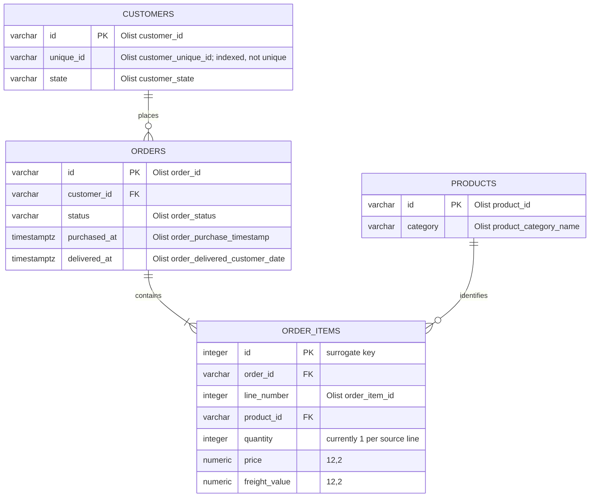

# Olist data model

The Kaggle Olist archive is not loaded into PostgreSQL as a collection of raw CSV-shaped
tables. The importer reads the source files into a small, normalized relational model designed
around the dashboard's order, revenue, category, and cohort queries.

## Relationship model

`users` is a separate authentication table. `dataset_metadata` is also separate from the
business data and records the timestamp of the last successful `olist` import.

## PostgreSQL tables

| Table | Purpose | Keys and constraints |
| --- | --- | --- |
| `customers` | One row per Olist `customer_id`, with the stable repeat-customer identity retained for cohort analysis. | `id` primary key; `unique_id` and `state` indexed. `unique_id` is intentionally not unique because multiple Olist customer records can belong to the same real customer. |
| `products` | Product lookup used for category revenue analysis. | `id` primary key; `category` indexed and nullable for uncategorized products. |
| `orders` | Order-level status, customer relationship, and timestamps. | `id` primary key; `customer_id` foreign key to `customers`; indexes on customer, status, purchase time, and status/purchase time. |
| `order_items` | Line-level commercial facts used to calculate item count, product value, freight, and order totals. | Surrogate `id` primary key; `order_id` and `product_id` foreign keys; unique `(order_id, line_number)`. |
| `dataset_metadata` | Import operational metadata. | `dataset_name` primary key; `last_imported_at` timestamp. |

The schema is created and evolved by the Alembic migrations in `backend/alembic/versions/`.
The SQLAlchemy table definitions are in
`backend/src/boutique/infrastructure/database/models.py`.

## Kaggle-to-schema mapping

The importer accepts these four source files and maps only the fields needed by the
application:

| Source CSV | PostgreSQL mapping | Transformation or rationale |
| --- | --- | --- |
| `olist_customers_dataset.csv` | `customers.id` ← `customer_id`; `customers.unique_id` ← `customer_unique_id`; `customers.state` ← `customer_state` | The stable `customer_unique_id` is retained separately from the order-scoped `customer_id` so repeat-customer cohorts can be calculated. The ZIP-code prefix is not needed by the dashboard. |
| `olist_products_dataset.csv` | `products.id` ← `product_id`; `products.category` ← `product_category_name` | Empty categories become `NULL` and are displayed as `Uncategorized`. Product dimensions, weight, photos, and text-length fields are outside the current analytics scope. |
| `olist_orders_dataset.csv` | `orders.id` ← `order_id`; `orders.customer_id` ← `customer_id`; `orders.status` ← `order_status`; `orders.purchased_at` ← `order_purchase_timestamp`; `orders.delivered_at` ← `order_delivered_customer_date` | Timestamps are parsed as UTC-aware values. Approval, carrier, estimated-delivery, and other lifecycle timestamps are not currently queried. |
| `olist_order_items_dataset.csv` | `order_items.order_id` ← `order_id`; `line_number` ← `order_item_id`; `product_id` ← `product_id`; `price` ← `price`; `freight_value` ← `freight_value` | Olist represents each purchased line as a row and does not provide a quantity column in this file, so each imported line has `quantity = 1`. Seller and shipping-limit fields are not currently needed. |

The other files in the full Olist archive—seller, geolocation, payment, and review data—are
not imported because they do not support the current dashboard features. They can be added as
separate bounded tables later without changing the core order relationship.

## Import behavior

1. The API downloads the archive server-side and validates that the four required CSVs exist.
2. The CSV adapter converts source column names and timestamps into the schema fields above.
3. Customers, products, orders, and order items are inserted in batches in one transaction.
4. `dataset_metadata.last_imported_at` is written in that same transaction.
5. Dashboard cache entries are invalidated only after the transaction commits.

Re-importing with `--replace` (or the corresponding confirmation in the UI) truncates the
Olist tables and reloads them. This makes the import repeatable while ensuring that a failed
load does not leave a partially refreshed dataset.
